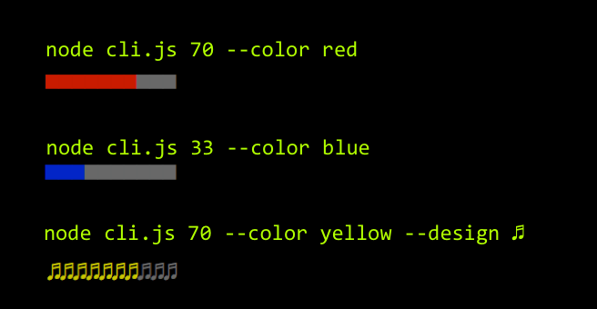

# Loading Bar [](https://badge.fury.io/js/loadingbar)[](https://travis-ci.org/shariati/loadingbar)[](https://coveralls.io/github/shariati/loadingbar?branch=master)[](https://snyk.io/test/github/shariati/loadingbar)
A customisable loading bar (Progressbar)

These are our loading bar examples.



## Install

```
$ npm install --save loadingbar
```


## Usage

```js
const loadingbar = require('loadingbar');

loadingbar(20);

```


## CLI

```
$ npm install --global loadingbar
```

```
$ loadingbar --help

  Usage
    loadingbar <percentage>
    loadingbar <percentage> --color red
    loadingbar <percentage> --design ♫
    loadingbar <percentage> --sizeInColumns 20

  Example
    loadingbar 10
    loadingbar 10 --color red
    loadingbar 10 --color blue --design #
    loadingbar 10 --color blue --design # --sizeInColumns 20
